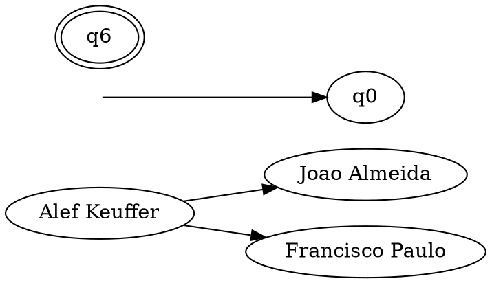

# PLC - Processamento de Linguagens e Compiladores (Trabalho Prático 1)

Grupo:

1. Alef Keuffer (A91383)
2. [Ivo Lima](https://github.com/IvoLims) (A90214)
3. [Catarina Quintas](https://github.com/CatarinaQuintas) (A91650)

## BibTex format

<P STYLE="font-variant:small-caps">My name is Hege Refsnes.</p>

### Entries

A BibTeX entry consists of the **type**, a **citation-key** and a number of **tags** which define various characteristics of the specific BibTeX entry[^format].
<!--
Type
  : word after @

We have a total of 17 entry types, where 14 specify the type of publication and 3 have use specific to BibTex.

Entries used are not case sensitive^[https://tex.stackexchange.com/questions/163687/is-there-a-preferred-capitalization-style-for-reference-types-in-bibtex-biblatex].

The documentation says BibTeX-files may contain four different types of entries: @string, @preamble, @comment and Entries (e.g. @article, @book, etc)[^format]. This may make ambigous the difference between type of entry and entry type. Just assume 4 types of entry and 17 entry types, where 14 belong to one type of entry (which is named entry).

Note that:

@string
  : defines abbreviations which can later be used in a tag.

@preamble
  : defines how special text should be formatted.

@comment
  : for comments not taken in regard by BibTeX.

Entries
  : each declares a single reference to a type of publication.
 -->

<dl>
<dt>Type</dt>
<dd>word after @
</dd>
</dl>
<p>We have a total of 17 entry types, where 14 specify the type of publication and 3 have use specific to BibTex.</p>
<p>Entries used are not case sensitive<a href="#fn2" class="footnote-ref" id="fnref2" role="doc-noteref"><sup>2</sup></a>.</p>
<p>The documentation says BibTeX-files may contain four different types of entries: <span class="citation" data-cites="string">@string</span>, <span class="citation" data-cites="preamble">@preamble</span>, <span class="citation" data-cites="comment">@comment</span> and Entries (e.g. <span class="citation" data-cites="article">@article</span>, <span class="citation" data-cites="book">@book</span>, etc)<a href="#fn3" class="footnote-ref" id="fnref3" role="doc-noteref"><sup>3</sup></a>. This may make ambigous the difference between type of entry and entry type. Just assume 4 types of entry and 17 entry types, where 14 belong to one type of entry (which is named entry).</p>
<p>Note that:</p>
<dl>
<dt><span class="citation" data-cites="string">@string</span></dt>
<dd>defines abbreviations which can later be used in a tag.
</dd>
<dt><span class="citation" data-cites="preamble">@preamble</span></dt>
<dd>defines how special text should be formatted.
</dd>
<dt><span class="citation" data-cites="comment">@comment</span></dt>
<dd>for comments not taken in regard by BibTeX.
</dd>
<dt>Entries</dt>
<dd>each declares a single reference to a type of publication.
</dd>
</dl>

There are 14 types of publication^[https://www.bibtex.com/e/entry-types/], that is, 14 entries of the type entry:

```txt
@article
@book
@booklet
@conference
@inbook
@incollection
@inproceedings
@manual
@mastersthesis
@misc
@phdthesis
@proceedings
@techreport
@unpublished
```

<!-- Citation-key
  : First word after {

Tag
  : A BibTeX tag is specified by its **name followed by an equals-sign and the content**. The tag's name **is not case-sensitive**. The **content needs to be enclosed by either curly braces or quotation-marks**. Which form of enclosure is used is depending on the user's taste, and both can be applied together in a single BibTeX entry, but there is one difference between those two methods: **When quotation-marks are used, string concatenation using # is possible, but not when braces are used.**[^format] -->

<dl>
<dt>Citation-key</dt>
<dd>First word after {
</dd>
<dt>Tag</dt>
<dd>A BibTeX tag is specified by its <strong>name followed by an equals-sign and the content</strong>. The tag&#x2019;s name <strong>is not case-sensitive</strong>. The <strong>content needs to be enclosed by either curly braces or quotation-marks</strong>. Which form of enclosure is used is depending on the user&#x2019;s taste, and both can be applied together in a single BibTeX entry, but there is one difference between those two methods: <strong>When quotation-marks are used, string concatenation using # is possible, but not when braces are used.</strong><a href="#fn5" class="footnote-ref" id="fnref5" role="doc-noteref"><sup>5</sup></a>
</dd>
</dl>

Fiels recognized in standard bibtex format[^std]:

```txt {line-numbers}
address
annote
author
booktitle
chapter
crossref
edition
editor
howpublished
institution
journal
key
month
note
number
organization
pages
publisher
school
series
title
type
volume
year
```

[^format]: http://www.bibtex.org/Format/
[^std]: https://www.openoffice.org/bibliographic/bibtex-defs.html

## Esboco

1. Categoria
   - chave, autor, titulo
   - ...
2. Categoria
   - chave, autor, titulo
   - ...



Note que $$T_2O$$

Note que $T_2O$